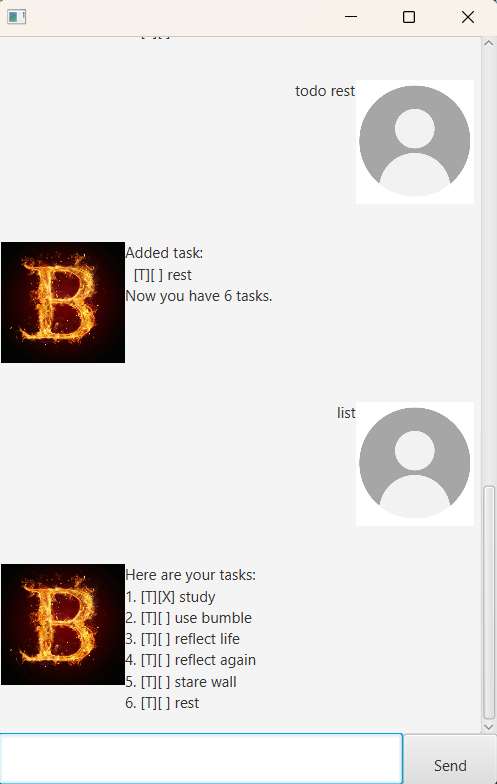

# Bryan User Guide

Bryan is your personal task manager and assistant, designed to help you manage your daily tasks efficiently. Whether you need to add a todo, set a deadline, schedule an event, or even snooze a deadline, Bryan has you covered.



*Note: The screenshot above (Ui.png) shows the full application window including the title bar, chat area, and input area.*

---

## Overview

Bryan is a desktop application built using JavaFX. It supports a range of commands to help you manage your tasks, including:
- Adding tasks (todo, deadline, event)
- Listing tasks
- Marking tasks as done or not done
- Deleting tasks
- Finding tasks by keyword
- Snoozing deadlines
- Exiting the application

---

## Getting Started

1. **Installation:**
   - Ensure you have Java 17 (or later) installed.
   - Download the latest Bryan Chatbot JAR from the releases page.
   - Double-click the JAR file to launch the application.

2. **Using the Application:**
   - The application window shows your chat area, where you can type commands.
   - Type your command into the text field at the bottom and press **Enter** or click the **Send** button.

---

## Commands and Features

### Adding a Todo
- **Command:** `todo DESCRIPTION`
- **Example:**  
- **Outcome:**  
A new todo is added and the chatbot responds:

### Adding a Deadline
- **Command:** `deadline DESCRIPTION /by YYYY-MM-DD`
- **Example:**  
- **Outcome:**  
A deadline task is added:

### Adding an Event
- **Command:** `event DESCRIPTION /from START /to END`
- **Example:**  
- **Outcome:**  
An event task is added:

### Listing Tasks
- **Command:** `list`
- **Outcome:**  
The chatbot displays all tasks:

### Marking and Unmarking Tasks
- **Command:** `mark INDEX` or `unmark INDEX`
- **Example:**  
- **Outcome:**  
The chatbot marks the first task as done:

Similarly, `unmark 1` will mark it as not done.

### Deleting Tasks
- **Command:** `delete INDEX`
- **Example:**  
- **Outcome:**  
The chatbot deletes the task at position 2.

### Finding Tasks
- **Command:** `find KEYWORD`
- **Example:**  
- **Outcome:**  
The chatbot shows tasks containing "book".

### Snoozing Deadlines
- **Command:** `snooze INDEX YYYY-MM-DD`
- **Example:**  
- **Outcome:**  
The chatbot updates the due date of the deadline task at position 2:

### Exiting the Application
- **Command:** `bye`
- **Outcome:**  
Bryan displays a farewell message and exits after a short delay.

---

## FAQ

**Q:** How is my data saved?  
**A:** Bryan automatically saves your tasks to a file (`data/bryan.txt`) after most commands.

**Q:** Which version of Java do I need?  
**A:** Bryan requires Java 17 or later.

---

## Troubleshooting

- If the application does not start, try running it from the command line:
```bash
java -jar Bryan.jar

## Contact

For any issues or questions, please open an issue on GitHub. https://github.com/bkkuan/ip/issues


